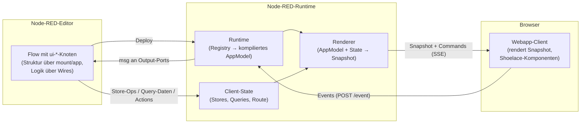

# Einführung

Was node-red-contrib-webapp ist — und das mentale Modell dahinter auf einer
Seite.

> English (canonical): [../introduction.md](../introduction.md)

## Was ist node-red-contrib-webapp?

node-red-contrib-webapp ist ein Satz von Node-RED-Knoten, mit denen du
**Web-Anwendungen deklarativ aus Flows** baust. Statt HTML, CSS und
Frontend-JavaScript zu schreiben, ziehst du Knoten wie `ui-app`, `ui-route`,
`ui-text`, `ui-button` oder `ui-table` auf den Node-RED-Canvas, konfigurierst
sie und deployst. Das Ergebnis ist eine live laufende, mehrbenutzerfähige
Web-App, ausgeliefert von deiner Node-RED-Instanz — mit Routing, Dialogen,
Formularen, State, Theming und Auth-Guards, alles beschrieben durch
Knoten-Konfiguration.

Die Anwendungs-**Logik** bleibt dort, wo sie in Node-RED hingehört: im
verdrahteten Flow. Ein Button-Klick kommt als gewöhnliche Message am
Output-Port des Button-Knotens an; was dann passiert (API aufrufen, Datenbank
schreiben, State ändern, navigieren), entscheiden die dahinter verdrahteten
Knoten.

## Das Kern-Modell auf einer Seite

Zwei Dinge tragen die gesamte Information — und sie sind strikt getrennt:

1. **Knoten-Konfiguration beschreibt die Struktur.** Jeder sichtbare Knoten
   deklariert über sein `mount`-Feld, *wo er lebt* (sein Eltern-Slot), und
   über sein `app`-Feld, *zu welcher App er gehört*. Die UI-Hierarchie — App →
   Routen/Dialoge → Container → Blatt-Komponenten — entsteht **ausschließlich**
   aus diesen Feldern, **nie aus Wires**. Siehe den
   [Layout-&-Slots-Guide](guides/layout-slots.md).
2. **Wires tragen Daten und Events.** Ein Wire bedeutet nie „das ist in
   jenem enthalten". Wires transportieren Messages: Events, die aus Komponenten
   herausfließen (Klick, Änderung, Submit, Routen-Wechsel), und Daten oder
   Kommandos, die hineinfließen (Store-Operationen, Query-Daten, Actions).

Auf dieser Struktur sitzen drei Laufzeit-Konzepte:

- **Bindings** verbinden Komponenten-Felder mit Live-Werten. Fast jedes Feld
  (der Wert eines Texts, die Zeilen einer Tabelle, Sichtbarkeit oder Farbe
  eines Elements) kann an eine Quelle gebunden werden: ein Literal, einen
  [Store](guides/bindings-state.md), eine Query, einen Routen-Parameter, den
  angemeldeten Benutzer, eine eingehende Message und mehr. Gebundene Werte
  aktualisieren sich live im Browser.
- **Events** fließen Client → Server. Nutzerinteraktionen werden als
  `msg.ui`-Event-Messages am Output-Port des Quell-Knotens emittiert; dein
  Flow entscheidet die Reaktion. Siehe
  [Actions & Events](guides/actions-events.md).
- **Actions** fließen Server → Client. Eine `ui-action` (oder jeder Knoten,
  der den `msg.ui.action`-Contract erzeugt) sagt der UI, dass sie navigieren,
  einen Dialog öffnen/schließen, ein-/ausblenden, aktivieren/deaktivieren oder
  fokussieren soll — nur Interaktionszustand, nie Daten.

## Wie eine Seite in den Browser kommt

Der Server rendert das App-Modell in einen framework-neutralen **Snapshot**
und liefert ihn über **SSE** (Server-Sent Events) aus. Im Browser läuft ein
kleiner Vanilla-JS-Client, der den Stream abonniert:

- Beim Verbinden erhält er den initialen Snapshot und rendert die aktuelle
  Route.
- Jede State-Änderung (Store-Update, Query-Daten, Deploy) pusht einen
  frischen Snapshot; der Client re-rendert mit einem keyed Morph, sodass
  Fokus und Scroll-Position Updates überleben.
- Interaktionsbefehle (navigieren, Dialog öffnen, …) werden als separate
  SSE-`command`-Events gepusht.
- Nutzerinteraktionen laufen über `POST /webapp/<appId>/event` zurück und
  werden in deinen Flow emittiert.

Gerendert wird mit Web Components ([Shoelace](https://shoelace.style/))
hinter einem backend-agnostischen Modell — du konfigurierst semantische Props
und Varianten, und ein einziger Satz Design-Tokens themet alles. Siehe
[Theming & Komponenten](guides/theming-components.md).

## Was du out of the box bekommst

- **Mehrseitige Apps**: Routen mit Parametern (`/customers/:id`), Dialoge,
  Navigation — [Navigation & Dialoge](guides/navigation-dialogs.md).
- **State**: veränderbarer Client-State über `ui-store`, server-geladene
  read-only Daten mit Lade-Lebenszyklus über `ui-query` —
  [Bindings & State](guides/bindings-state.md) und
  [Daten anzeigen](guides/displaying-data.md).
- **Formulare**: bidirektionale Input-Bindings (aus einem Store lesen, bei
  Änderung/Submit zurückschreiben, ohne Wiring) — [Formulare](guides/forms.md).
- **Auth**: Identität aus einem authentifizierenden Reverse-Proxy, eine
  `user`-Binding-Quelle und server-erzwungene Routen-/Dialog-Guards —
  [Auth](guides/auth.md).
- **Multi-User**: jeder Browser-Tab ist ein Client; State kann an alle
  Clients gebroadcastet oder auf einen einzelnen gescopet werden.

## Wie weiter

- [Erste Schritte](getting-started.md) — installieren und die erste App in
  zehn Minuten bauen.
- Die [Guides](README.md#inhalt) — einer pro großem Thema.
- Die [Knoten-Referenz](README.md#inhalt) — eine Seite pro Knoten.
