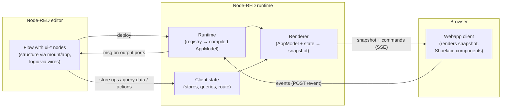

# Introduction

What node-red-contrib-webapp is, and the one-page mental model behind it.

> Deutsch: [de/introduction.md](de/introduction.md)

## What is node-red-contrib-webapp?

node-red-contrib-webapp is a set of Node-RED nodes that let you build **web
applications declaratively, from flows**. Instead of writing HTML, CSS, and
frontend JavaScript, you drop nodes like `ui-app`, `ui-route`, `ui-text`,
`ui-button`, or `ui-table` onto the Node-RED canvas, configure them, and
deploy. The result is a live, multi-user web app served by your Node-RED
instance — with routing, dialogs, forms, state, theming, and authentication
guards, all described by node configuration.

The application **logic** stays where it belongs in Node-RED: in the wired
flow. A button click arrives as an ordinary message on the button node's
output port; what happens next (call an API, write a database, update state,
navigate) is decided by the nodes you wire behind it.

## The core model in one page

Two things carry all the information, and they are strictly separated:

1. **Node configuration describes the structure.** Every visible node
   declares *where it lives* via its `mount` field (its parent slot) and
   *which app it belongs to* via its `app` field. The UI hierarchy — app →
   routes/dialogs → containers → leaf components — comes **exclusively** from
   these fields, **never from wires**. See the
   [Layout & Slots guide](guides/layout-slots.md).
2. **Wires carry data and events.** A wire never means "this is inside
   that". Wires transport messages: events flowing out of components
   (click, change, submit, route enter/leave) and data or commands flowing
   into them (store operations, query data, actions).

On top of that structure sit three runtime concepts:

- **Bindings** connect component fields to live values. Almost every field
  (a text's value, a table's rows, an element's visibility or colour) can be
  bound to a source: a literal, a [store](guides/bindings-state.md), a query,
  a route parameter, the authenticated user, an incoming message, and more.
  Bound values update live in the browser.
- **Events** flow client → server. User interactions are emitted as
  `msg.ui` event messages on the source node's output port; your flow decides
  the reaction. See [Actions & Events](guides/actions-events.md).
- **Actions** flow server → client. A `ui-action` (or any node producing the
  `msg.ui.action` contract) tells the UI to navigate, open/close a dialog,
  show/hide, enable/disable, or focus — interaction state only, never data.

## How a page reaches the browser

The server renders the app model into a framework-neutral **snapshot** and
delivers it over **SSE** (Server-Sent Events). The browser runs a small
vanilla-JS client that subscribes to the stream:

- On connect it receives the initial snapshot and renders the current route.
- Every state change (store update, query data, deploy) pushes a fresh
  snapshot; the client re-renders with a keyed morph, so focus and scroll
  position survive updates.
- Interaction commands (navigate, open dialog, …) are pushed as separate SSE
  `command` events.
- User interactions travel back over `POST /webapp/<appId>/event` and are
  emitted into your flow.

Rendering uses web components ([Shoelace](https://shoelace.style/)) behind a
backend-agnostic model — you configure semantic props and variants, and a
single set of design tokens themes everything. See
[Theming & Components](guides/theming-components.md).

## What you get out of the box

- **Multi-page apps**: routes with parameters (`/customers/:id`), dialogs,
  navigation — [Navigation & Dialogs](guides/navigation-dialogs.md).
- **State**: mutable client state via `ui-store`, server-loaded read-only
  data with loading lifecycle via `ui-query` —
  [Bindings & State](guides/bindings-state.md) and
  [Displaying data](guides/displaying-data.md).
- **Forms**: bidirectional input bindings (read from a store, write back on
  change/submit, no wiring needed) — [Forms](guides/forms.md).
- **Auth**: identity from an authenticating reverse proxy, a `user` binding
  source, and server-enforced route/dialog guards — [Auth](guides/auth.md).
- **Multi-user**: every browser tab is a client; state can be broadcast to
  all clients or scoped to one.

## Where next

- [Getting started](getting-started.md) — install and build your first app
  in ten minutes.
- The [guides](README.md#contents) — one per big topic.
- The [node reference](README.md#contents) — one page per node.
